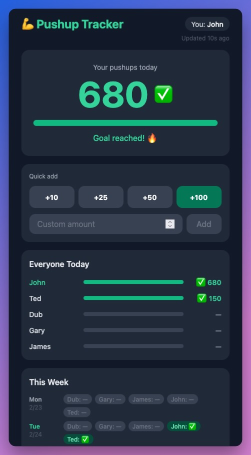

# pushup-tracker
Dead simple pwa for tracking pushup counts. It was made for the "what you can build in 1 hour stream".

> [!TIP]
> Click Add to Homescreen to install this as an app

## 100 Push-ups for 100 days
The idea is you do 100 pushups a day for 100 days. Cheat, spread them out, do whatever you need to do to get 100 before midnight PST each day. This crappy app just tracks how many you do and logs your streaks for how many days you go without missing the 100 requirement. My previous streak was 141 days before I got sick on vacation and forgot to do them.

